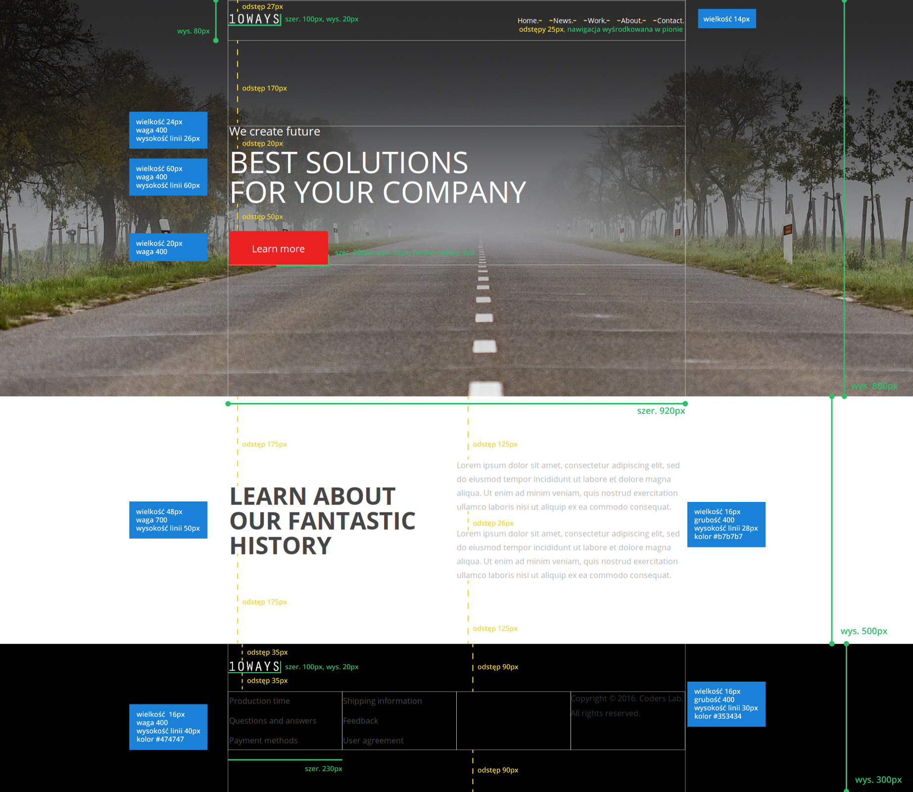

# Podsumowanie HTML i CSS

**Wytyczne dotyczące repozytorium**

1. Stwórz [*fork*](https://guides.github.com/activities/forking/) repozytorium z zadaniami.
2. Sklonuj repozytorium na swój komputer. Użyj do tego komendy `git clone adres_repozytorium`
Adres repozytorium możesz znaleźć na stronie repozytorium po naciśnięciu w guzik "Clone or download".
3. Rozwiąż zadania i skomituj zmiany do swojego repozytorium. Użyj do tego komend `git add nazwa_pliku`, lub aby dodać wszystkie zmienione pliki. 
`git add .`  Pamiętaj że kropka na końcu jest ważna! 
Następnie skomituj zmiany komendą `git commit -m "nazwa_commita"`
4. Wypchnij zmiany do swojego repozytorium na GitHubie.  Użyj do tego komendy `git push origin master`
5. Stwórz [*pull request*](https://help.github.com/articles/creating-a-pull-request) do oryginalnego repozytorium po wykonaniu zadania

## Zadanie

Aby stworzyć projekt, przyjrzyj się grafice strony, którą znajdziesz niżej (Obrazek bez linii wymiarowych), oraz przeczytaj 
wytyczne dotyczące projektu.

Zmiany wprowadzaj w następujących plikach:
* **index.html**
* **style.css**

### Wytyczne dotyczące projektu

**Postaraj się, aby projekt był pixel perfect, a kod był czytelny i semantycznie poprawny**

* Przygotuj plik CSS. Zacznij od resetu CSS. 

* Dodaj font do projektu. Font użyty w projekcie to **Open Sans**. 

* Stwórz header. Do elementu `header` wstaw logo oraz nawigację i ustaw je w odpowiednich miejscach. Wysokość headera nie jest podana. Wczytaj go jako tło i dostosuj wysokość do widoku zgodnie z grafiką.

* Wewnątrz elementu `header` wstaw również  nagłówki i przycisk. Odstępy i wysokość przycisku są zaznaczone na obrazku niżej -  Linie wymiarowe.

* Drugą sekcję (pod headerem) podziel na dwie równe części. W prawej kolumnie wstaw tekst z pliku `text.txt`.

* W elemencie `footer` wstaw logo oraz nawigację. Logo powinno mieć taką samą wielkość jak w elemencie `header`.

## Twój Layout

## Linie wymiarowe 

